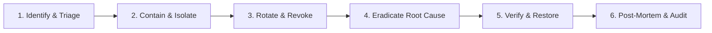

# STORE STING — Security Incident Response Plan

This document establishes the incident response lifecycle for security anomalies, credential compromises, data integrity incidents, or vulnerabilities discovered in **STORE STING**.

---

## 1. Incident Severity Classification

| Level | Impact | Examples | Target Response |
| :--- | :--- | :--- | :--- |
| **SEV-1 (Critical)** | Active compromise of database, production secrets leaked, active data exfiltration | Leaked Neon `DATABASE_URL`, leaked production JWT signing key, remote code execution | < 1 hour |
| **SEV-2 (High)** | Authentication bypass, privilege escalation, broken access control (IDOR) | Customer accessing other customer orders, unauthenticated admin API access | < 4 hours |
| **SEV-3 (Medium)** | Denial of service vector, non-sensitive credential disclosure, transient injection | Missing rate limit on search, CORS misconfiguration without sensitive data | < 24 hours |
| **SEV-4 (Low)** | Minor info disclosure, missing best-practice headers, outdated dev dependencies | Missing HSTS header, informational dependency warning | < 72 hours |

---

## 2. Six-Step Containment & Remediation Lifecycle

### Step 1: Identify & Triage
- Confirm the veracity and scope of the report or alarm.
- Determine whether data, infrastructure, or source code was exposed.
- Assign incident lead and establish private communication channel.

### Step 2: Contain & Isolate
- If database credentials are leaked: immediately reset password via Neon Console or CLI.
- If an API token is compromised: revoke the token immediately.
- If an endpoint is vulnerable to active exploitation: disable the route or apply rate limiting/WAF block rules.

### Step 3: Rotate & Revoke
- Execute rotation procedures from [docs/secret-rotation.md](secret-rotation.md).
- Revoke all sessions signed with compromised credentials.

### Step 4: Eradicate Root Cause
- Patch the vulnerable code path or remove the secret from source control.
- If sensitive history was committed: execute safe, reviewed history cleaning.

### Step 5: Verify & Restore
- Run full test suite: `pytest -v`, `scripts/verify_flow.py`, `npm run build`.
- Review audit logs for unexpected activity during the window of exposure.
- Deploy patched release.

### Step 6: Post-Mortem & Audit
- Document timeline, root cause, impact, and preventive actions.
- Update threat models and automated checks (e.g., secret scanners, CI linters).

---

## 3. Specific Playbooks

### Playbook A: Leaked Neon Database Connection String
1. **Rotate Password**: Immediately reset the role password via Neon Console:
   `Projects -> summer-grass-83091269 -> Roles -> Reset Password`.
2. **Update Environment**: Provide new connection string in production `.env`.
3. **Verify Git History**: Ensure the connection string was never committed to git.
4. **Inspect Connection Logs**: In Neon Dashboard, check compute logs for connections originating from unexpected IP addresses.

### Playbook B: Leaked JWT `SECRET_KEY`
1. **Regenerate Key**: Generate new 64-byte random key (`secrets.token_urlsafe(64)`).
2. **Deploy Update**: Restart backend workers and API instances.
3. **Force Re-Authentication**: All active tokens will immediately fail signature validation.

### Playbook C: Broken Object Level Authorization (IDOR) Reported
1. **Verify Authorization Filter**: Confirm endpoint enforces `user_id == current_user.id` or `current_user.role == 'admin'`.
2. **Review Affected Entities**: Query database logs for unauthorized order or address lookups.
3. **Add Automated Regression Test**: Add negative IDOR test to `backend/tests/test_hardening.py`.

---

## 4. Reporting Contacts

To report vulnerabilities responsibly, refer to [SECURITY.md](../SECURITY.md).
